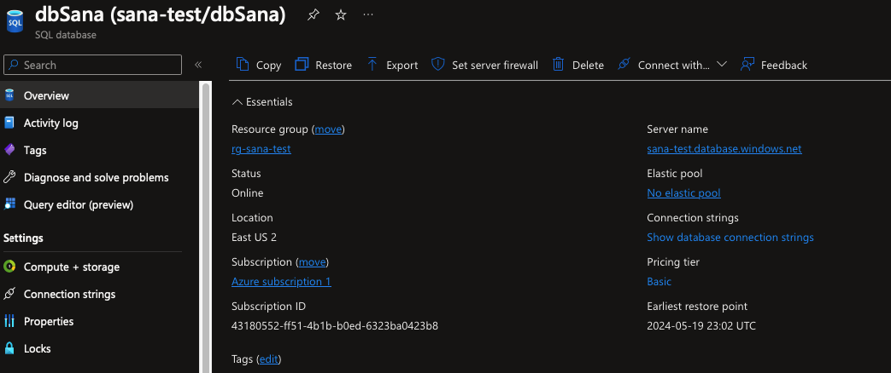
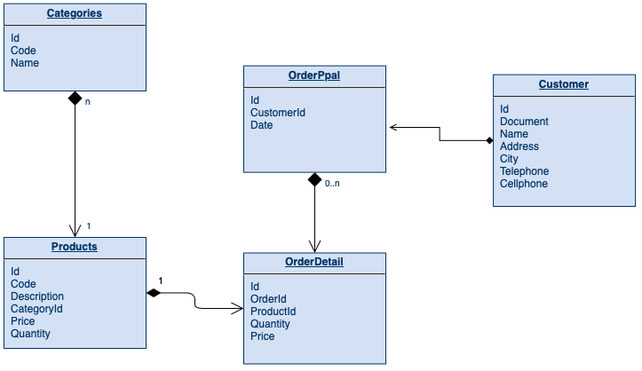
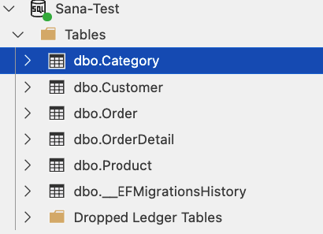
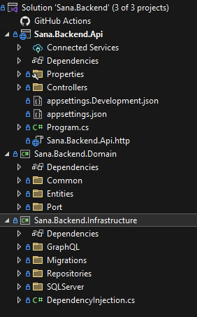
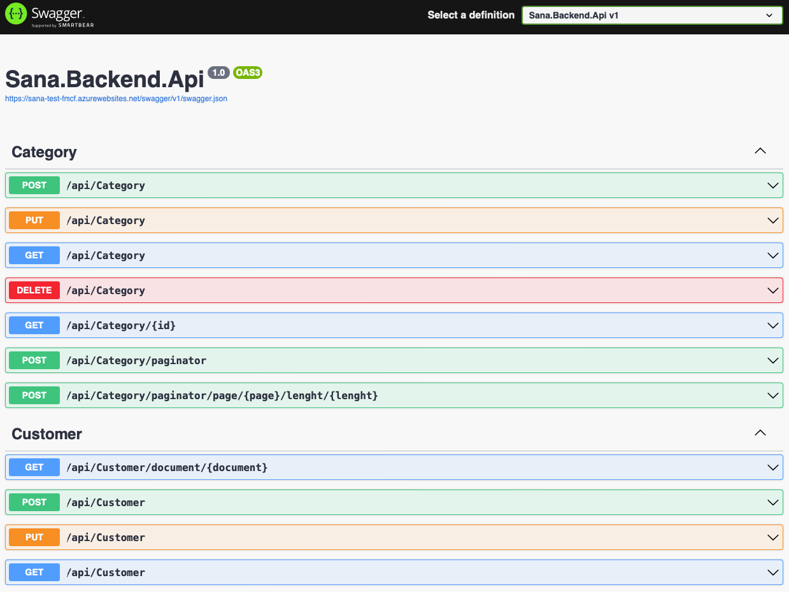
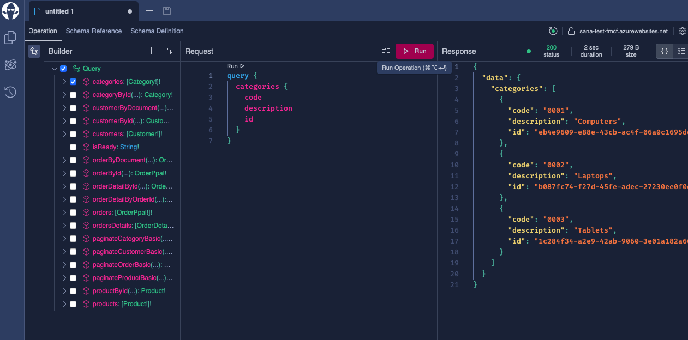
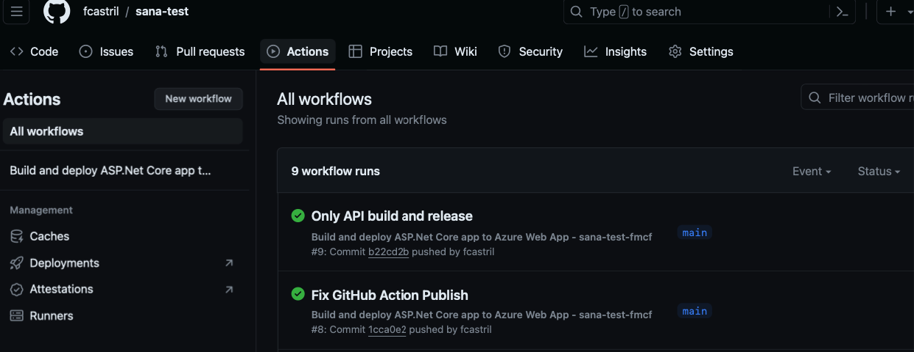

# Technical Test
## Company: Sana
*Autor: Fabián Mauricio Castrillón Franco*

### Part 1: Database Design

The database was design in SQL Server, and deploy en Azure SQL server.

**Connection String:** 

`Server=tcp:sana-test.database.windows.net,1433;Initial Catalog=dbSana;Persist Security Info=False;User ID=sa-sana;Password=S4n413579*;MultipleActiveResultSets=False;Encrypt=True;TrustServerCertificate=False;Connection Timeout=30;`

**Note:** If you want to connect to the database through an IDE like SQL Server Managment Studio or Azure Data Studio you must give access to the IP in the Firewall, if necessary please send the necessary IP to the email fcastril@gmail.com.

**Database Schema**

**Tables**

### Part 2: Application Development (Backend)

Repository in GITHUB: [Link GITHUB](https://github.com/fcastril/sana-test)

The backend is implemented in .Net Core 8.0 in C#.

Se implementa en dos tecnologías:

- API Resful con documentación en SWAGGER [Link Swagger](https://sana-test-fmcf.azurewebsites.net/swagger/index.html)

- GraphQL [Link GraphQL](https://sana-test-fmcf.azurewebsites.net/graphql)

Additional CI / CD implemented with Github Actions

